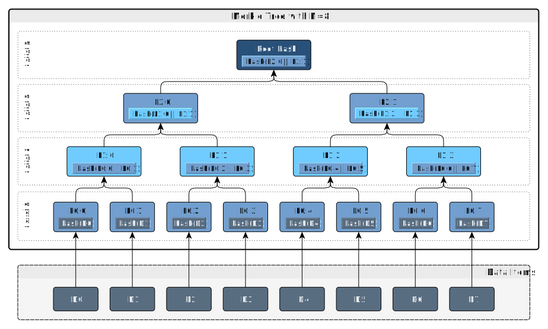
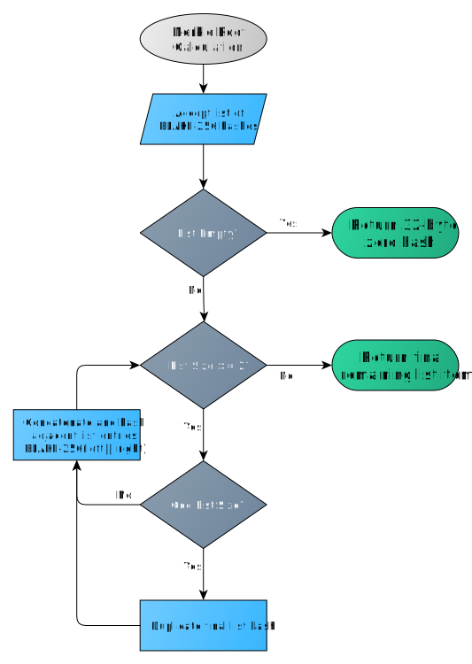

#  Merkle Root Construction

---

## Merkle Trees

A merkle tree is a hash-based data structure that summarizes all the transactions in a block. It can be used to quickly and efficiently verify whether or not a transaction is included in a block. 

Merkle trees are created by repeatedly hashing pairs of nodes until there is only one hash left, the Merkle Root. They are constructed from the bottom up, from hashes of the leaf nodes (hashes of the raw input data). The diagram below shows a merkle root constructed from eight leaf nodes. 

When calculating the merkle roots included in the block header, the data items are the transaction IDs of the transactions in the block.

Regular transactions and stake-based transactions (ticket purchases, votes, revocations) have separate merkle trees. Regular transactions are hashed to the `MerkleRoot` tree. Stake-based transactions are hashed to the `StakeRoot` tree. 

### Hash Function

Unless otherwise specified, all hashing operations **must** be performed with the BLAKE-256 hash function with 14 rounds.

## Merkle Root Construction

All Merkle trees **must** be constructed according to the unique Merkle tree construct originally implemented by Satoshi, which relies on construction of the tree from an ordered list as follows:

1. Calculate list of BLAKE-256 hashes of original data (e.g. transaction IDs) 
1. If the list is empty, return a 32-byte root hash of all zeroes; otherwise
1. While the list contains two or more items:
	- If the number of items remaining in the list is odd, duplicate the final hash
	- Combine each pair of adjacent entries with the BLAKE-256 hash of the two entries concatenated together. The list will have ceil(N/2) entries remaining after combining the adjacent entries
1. Return the final remaining item in the list as the Merkle root

The below diagram illustrates these steps.

!!! warning "Warning"
	The requirement for duplicating the final hash for internal tree levels that have an odd number of nodes must be carefully considered by applications making use of the resulting Merkle root because it means the final calculated Merkle root for a tree that internally duplicated a hash and one that actually included a duplicate hash at that position will be indistinguishable.

**{SB: below is from Bitcoin dev docs. Needs updating for decred?}**

Before the merkle root is calculated, the TXIDs are first placed in order as required by the
consensus rules:

* The coinbase transaction's TXID is always placed first.

* Any input within this block can spend an output which also appears in
  this block (assuming the spend is otherwise valid). However, the TXID
  corresponding to the output must be placed at some point before the
  TXID corresponding to the input. This ensures that any program parsing
  block chain transactions linearly will encounter each output before it
  is used as an input.

If a block only has a coinbase transaction, the coinbase TXID is used as
the merkle root hash.

If a block only has a coinbase transaction and one other transaction,
the TXIDs of those two transactions are placed in order, concatenated as
64 raw bytes, and then SHA256(SHA256()) hashed together to form the
merkle root.

If a block has three or more transactions, intermediate merkle tree rows
are formed. The TXIDs are placed in order and paired, starting with the
coinbase transaction's TXID. Each pair is concatenated together as 64
raw bytes and SHA256(SHA256()) hashed to form a second row of
hashes. If there are an odd (non-even) number of TXIDs, the last TXID is
concatenated with a copy of itself and hashed. If there are more than
two hashes in the second row, the process is repeated to create a third
row (and, if necessary, repeated further to create additional rows).
Once a row is obtained with only two hashes, those hashes are concatenated and
hashed to produce the merkle root.

<!-- built block 170's merkle root with Python to confirm left-to-right order
     for A|B concatenation demonstrated below:
         sha256(sha256("82501c1178fa0b222c1f3d474ec726b832013f0a532b44bb620cce8624a5feb1169e1e83e930853391bc6f35f605c6754cfead57cf8387639d3b4096c54f18f4".decode("hex")).digest()).digest().encode("hex_codec")
-->

TXIDs and intermediate hashes are always in internal byte order when they're
concatenated, and the resulting merkle root is also in internal byte
order when it's placed in the block header.
