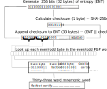

# { .dcr-icon } Seed Generation Process

---

A [seed](https://docs.decred.org/glossary/#seed) is used by a [Hierarchical Deterministic (HD) wallet](https://docs.decred.org/glossary/#hierarchical-deterministic-hd-wallet) to generate deterministic private/public keys. The Decred wallet (Decrediton/dcrwallet) seed is 256 bits (32 bytes) and the mnemonic seed is thirty-three words.  

The mnemonic seed generation process can be understood in three steps:

1. Generate 256 bits (32 bytes) of entropy (seed) from cryptographically random data.
1. Create a checksum by hashing the seed with SHA-256d, and append the first byte of the hash to the initial seed.
1. Look up each of the 33 bytes on the [PGP Word List](https://en.wikipedia.org/wiki/PGP_word_list); (a list of 512 words split into 256 even and odd phonetically distinct words), using even words for even bytes and odd words for odd bytes. 

